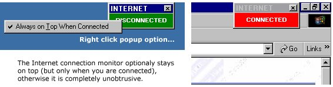

<div align="center">

## ConMon \- Internet Connection Monitor


</div>

### Description

This is a very small application that makes it obvious when your system has (with or without your knowledge) connected to the Internet. The small on-screen form stays on top when connected but otherwise is quite unobtrusive (sits behind other apps). As it is possible for even commercial applications to connect WITHOUT prompting (they shouldn't but sometimes do), I have found this to be a necessary addition to my desktop. I thought I'd share the little bit of source code I used to create the program. It isn't complex but does use API calls so I've put it in the Intermediate category. Comments/improvements welcome.
 
### More Info
 
Peace of mind.


<span>             |<span>
---                |---
**Submitted On**   |2002-06-21 15:38:10
**By**             |[Dave Lambert](https://github.com/Planet-Source-Code/PSCIndex/blob/master/ByAuthor/dave-lambert.md)
**Level**          |Intermediate
**User Rating**    |5.0 (15 globes from 3 users)
**Compatibility**  |VB 6\.0
**Category**       |[Complete Applications](https://github.com/Planet-Source-Code/PSCIndex/blob/master/ByCategory/complete-applications__1-27.md)
**World**          |[Visual Basic](https://github.com/Planet-Source-Code/PSCIndex/blob/master/ByWorld/visual-basic.md)
**Archive File**   |[ConMon\_\-\_I972446212002\.zip](https://github.com/Planet-Source-Code/dave-lambert-conmon-internet-connection-monitor__1-36109/archive/master.zip)

### API Declarations

```
Private Declare Function InternetGetConnectedState _
  Lib "wininet.dll" (ByRef lpdwFlags As Long, _
  ByVal dwReserved As Long) As Long
Private Declare Function SetWindowPos Lib "user32" _
        (ByVal hwnd As Long, _
         ByVal hWndInsertAfter As Long, _
         ByVal x As Long, _
         ByVal y As Long, _
         ByVal cx As Long, _
         ByVal cy As Long, _
         ByVal wFlags As Long) As Long
Private Const HWND_TOPMOST = -1
Private Const HWND_NOTOPMOST = -2
Private Const SWP_NOACTIVATE = &H10
Private Const SWP_SHOWWINDOW = &H40
```


